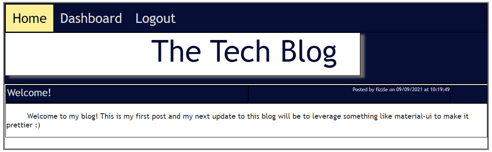

#THE TECH BLOG

This is a blog that manages user sessions and allows access to the various capabilities of the blog by the loggedin state. Currently, main capabilities are:
1. Log in
2. Log out
3. Sign up as a new user
3. Post a discussion - for a logged in user
4. Update a post - for a logged in user
5. Comment on a discussion - for a logged in user
6. View all posts on the entire blog site - regardless of logged in status.
7. Administrate ones own posted discussions - for a logged in user

## Visit the app live at:
https://leemacklinblog.herokuapp.com/

## Technologies used:
1.  vanilla javascript
2.  HTML
3.  Handlebars.js
4.  Node.js
5.  Heroku
6.  MySQL/JAWSDB MySQL

### And it does keep the following as dependencies for the server and application:
dependencies": {
    "bcrypt": "^5.0.1",
    "connect-session-sequelize": "^7.1.1",
    "dotenv": "^10.0.0",
    "express": "^4.17.1",
    "express-handlebars": "^5.3.2",
    "express-session": "^1.17.2",
    "handlebars.moment": "^1.0.4",
    "lodash": "^4.17.21",
    "mysql2": "^2.2.5",
    "nodemon": "^2.0.12",
    "sequelize": "^6.6.5"
}

## Future Developments
1.  Revisit the user interface particularly by leveraging Material-UI

## Credits
Created by Lee Macklin